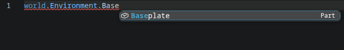
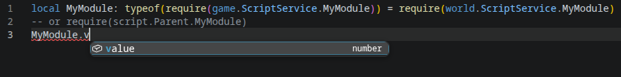

# polysource

External editor tooling for Polytoria 2.0. polysource reads the project's `.poly` world and writes a `sourcemap.json` that luau-lsp can read, giving you autocomplete for the entire instance tree. It also repairs the type definitions the Creator generates so they work with current luau-lsp, and lets you require modules with resolved types.

Works in any editor that runs luau-lsp: VS Code, Neovim, Zed, and more.





## Features

- Full instance-tree autocomplete from any script, as shown above.
- Module autocomplete. `require()` calls resolve to their files, so `require(game.ScriptService.MyModule)` or `require(script.Parent.MyModule)` shows the module's members instead of `any`. 
  Why `game` and not `world`? See [Typed require()](#typed-require).
- Generates a repaired and patched `def.modern.luau` for current (1.69+) luau-lsp next to the original one in `.poly/luau/`, with the `world` global patched so the sourcemap tree is reachable, and Polytoria's `require()` declaration removed so luau-lsp's own magic module resolution takes over.
- A `--watch` mode that regenerates the sourcemap whenever your world changes.

Some tradeoffs come with this, detailed under [Known limitations](#known-limitations).

## Typed require()

Luau-lsp resolves its own `require()` function only against the hardcoded values `game` and `script`, so `require(world.ScriptService.MyModule)` is typed `any` (though `world.ScriptService.MyModule` still autocompletes).

Two ways to get typed modules:

- `require()` relative to the current script:

      local MyModule = require(script.Parent.MyModule)

  Fully typed, but the path can be awkward to write.

- Keep using `world` or other global instances at runtime, and type it with a game-rooted `require()`:

      local MyModule: typeof(require(game.ScriptService.MyModule)) = require(world.ScriptService.MyModule)
  
  The `typeof(...)` gives the game-rooted type while the runtime value still comes from world.
  `game` has all of `world`'s children, as luau-lsp always treats it like the root of the instance tree, and gets ignored at runtime.

## Install

- Have Go installed?
    ```
    go install github.com/giaco6/polysource@latest
    ```
  This builds the current version and installs `polysource` into your Go bin folder (usually `~/go/bin`). Make sure that folder is on your PATH.

- Want a ready-made binary? Grab one for your platform from the [Releases page](https://github.com/giaco6/polysource/releases).

## Usage

```
polysource .                # generate sourcemap.json in the current project
polysource --watch .        # regenerate whenever the world changes
polysource defs .           # repair def.d.luau and write def.modern.luau
polysource defs --legacy .  # same, but keep old class syntax (pre-1.69 luau-lsp)
polysource --version
```
By default polysource reads `project.ptproj` and uses the world it points to.
Pass a specific world file with `--world`.

## Editor setup

Required:

- `luau-lsp.sourcemap.enabled: true`
- `luau-lsp.sourcemap.generatorCommand: "polysource --watch ."`
- `luau-lsp.platform.type: "roblox"` (sourcemap processing only runs on the `roblox` platform)

To load the repaired type definitions, add the generated file to the `luau-lsp.types.definitionFiles` setting and point it at `.poly/luau/def.modern.luau`. Run `polysource defs .` once to create it.

The `roblox` platform loads Roblox's bundled types. To reduce the clutter you do not need, disable globals through `luau-lsp.types.disabledGlobals`, for example:
  ```json
  {
    "luau-lsp.types.disabledGlobals": [
      "workspace", "plugin", "PluginManager",
      "settings", "UserSettings", "releaseType", "Version"
    ]
  }
  ```

## How it works
<details>
    <summary>How polysource works</summary>

  A `.poly` world is plain JSON, or Zstd-compressed JSON. polysource detects the format from the first byte and parses it into the instance tree.

  Scripts are linked files. Each instance stores a random GUID in its `LinkedScript` property, and the mapping from GUID to file path lives in `.meta` sidecars next to the scripts. polysource scans those sidecars, then builds a sourcemap where every linked script points at its file.

  The `defs` command converts the Creator's `def.d.luau` from the old `declare class` syntax to `declare extern type`, which modern luau-lsp requires.
  It also patches `world` so the sourcemap tree is reachable through it, and removes the Creator's `require()` declaration so luau-lsp's own magic module resolution can take over.
  Pass `--legacy` to skip the class syntax conversion for older luau-lsp versions.
</details>

## Known limitations

- Roblox methods appear on types that share a name with Roblox classes.
  Because the sourcemap only works when the platform is set to Roblox, luau-lsp loads Roblox's types alongside Polytoria's. A `Part` therefore shows Roblox properties, events and methods like `:FindFirstChild()` next to Polytoria's own.
  Fixing this requires luau-lsp supporting sourcemaps off the `roblox` platform.

- `:FindChild()` and similar methods are not autocompleted. Only dot and bracket indexing are. Autocompleting method calls like `world:FindChild("...")` would require hardcoding knowledge of the method into the language server.

- Typed `require()` calls need `game` or `script`, not `world`. See [Typed require()](#typed-require) above.

- The `world` global is typed as `World & DataModel`. It keeps Polytoria's World API while letting the sourcemap attach the instance tree to it.
  Also, when indexing `world` with `Instance.Parent` it shows up as only `DataModel`.

- One sourcemap per world. Use `--world` to target a different world.

## Development
Go 1.26.5+
```
go build .
```

## Feedback

Found a bug or want a feature? Open an issue or pull request!

## License

MIT
